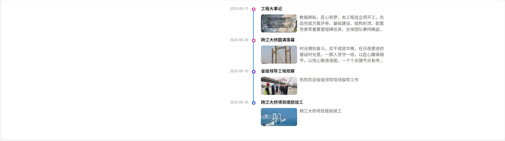
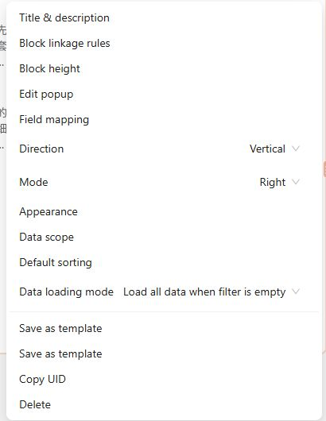

# Timeline Plugin

<div align="center">

English | [简体中文](./README.zh-CN.md)

</div>

`@youchaoyun/plugin-timeline` is a NocoBase timeline block plugin for displaying multi-record data along a time dimension. It works well for project milestones, event history, engineering progress, and other chronological scenarios.

The current version supports:

- vertical and horizontal timeline directions
- multiple layout modes for different reading patterns
- field mapping for title, summary, time, node, and title image
- record detail popups when users click a timeline item

## Features

- provides a `Time line` data block
- supports `Field mapping`
- supports `Direction` switching
- supports `Mode` switching
  - vertical: left, right, alternate
  - horizontal: top, bottom, alternate
- supports `Appearance` settings
  - line color
  - line width
  - node size
  - node offset
  - title spacing
  - time spacing
- supports `Data scope` filtering
- supports `Default sorting`
- supports dictionary-color nodes and attachment-image nodes
- supports start time and end time as dual time fields
- supports horizontal scrolling for wide timeline content
- supports opening record details through `openView`

## Block Overview

The plugin registers one timeline block for multi-record data:

- block name: `Time line`
- display name: `Timeline`

Once the block is bound to a collection, it renders the timeline based on the current query result.

## Preview

### Vertical Timeline



### Horizontal Timeline


### Timeline Settings



### 1. Field mapping

Field mapping defines which collection fields are used by the timeline. Common mappings include:

- `Title field`
- `Title image field`
- `Summary field`
- `Node field`
- `Start time field`
- `End time field`
- `Time format`

Notes:

- the node field can use either a dictionary field or an attachment field
- when both start time and end time are configured, the block renders a dual-time layout
- field mapping supports variable expressions such as `ctx.collection.xxx`

### 2. Direction

Available options:

- `Vertical`
- `Horizontal`

Notes:

- the vertical layout is based on Ant Design Timeline
- the horizontal layout is implemented with a custom structure inside the plugin

### 3. Mode

Available modes depend on the direction:

- vertical: `Left` / `Right` / `Alternate`
- horizontal: `Top` / `Bottom` / `Alternate`

### 4. Appearance

Appearance settings control the visual style of the timeline:

- `Timeline color`
- `Line width`
- `Node padding`
- `Node size`
- `Title padding`
- `Time padding`

Default appearance values:

```ts
{
  color: '#1890ff',
  lineWidth: 2,
  nodeSize: 12,
  nodePadding: -4,
  titlePadding: -7,
  timePadding: -6,
}
```

## Click Interaction

The plugin registers a timeline item click event:

- event name: `itemClick`

By default, the built-in `popupSettings` flow uses `openView` to open the current record in a popup.

## Mock Preview Without Data Source

If the block has not been bound to a data source yet, the plugin uses built-in mock data so the timeline can still be previewed in design mode.

## Extension Capability

By default, the plugin only exposes `attachment` as an available interface type for the `Title image field`.

If another plugin needs to extend the available interface types that can be selected as the title image field, it can call the client-side plugin instance like this:

```typescript
// client/plugin.tsx  multipleEntryModesAttachment is the interface type to register
const timelinePlugin = this.app.pm.get<any>('@youchaoyun/plugin-timeline');
timelinePlugin?.registerTimelineCoverFieldInterfaces?.(['multipleEntryModesAttachment']);
```

Notes:

- duplicate interface registrations are removed automatically
- registered interfaces will be included in the selectable range for the `Title image` field

## Peer Dependencies

The plugin declares the following `peerDependencies`:

- `@nocobase/client: 2.x`
- `@nocobase/server: 2.x`
- `@nocobase/test: 2.x`

## Related Documentation

- Chinese README: [`README.zh-CN.md`](./README.zh-CN.md)
- External documentation: [https://docs.youchaoyun.com/cn/infrastructure/nocobase_plugin_extension/](https://docs.youchaoyun.com/cn/infrastructure/nocobase_plugin_extension/)

## Noco Plugin Community

Welcome to join the Noco plugin community to discuss NocoBase plugin development, plugin usage, and enterprise extension practices.


If the QR code has expired, please visit the "More Plugins" page below to get the latest community entry.

## More Plugins

Youchaoyun continues to build NocoBase enterprise plugins and extension capabilities. See more here:

[More NocoBase plugin extensions](https://docs.youchaoyun.com/cn/infrastructure/nocobase_plugin_extension/)
