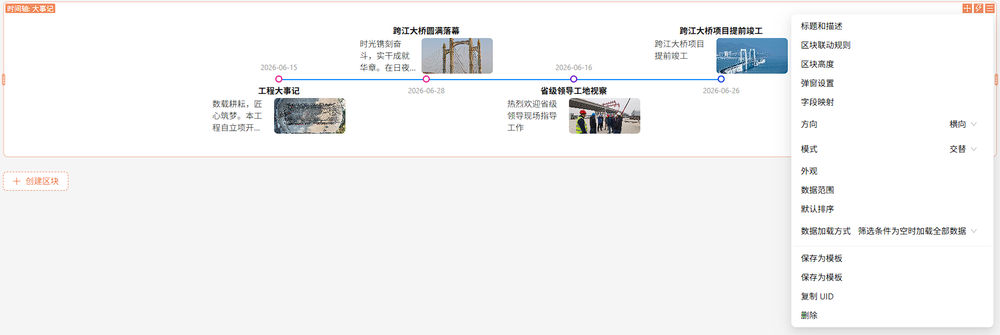

# @youchaoyun/plugin-timeline

`@youchaoyun/plugin-timeline` 是一个 NocoBase 时间轴区块插件，用于按时间维度展示数据记录，适合项目节点、事件轨迹、进度过程、历史变化等场景。

当前版本支持竖向时间轴和横向时间轴两种展示方式，并支持点击节点后打开记录详情弹窗。

## 功能特性

- 支持竖向时间轴和横向时间轴切换
- 支持多种布局模式
  - 竖向：左侧、右侧、交替
  - 横向：上方、下方、交替
- 支持标题、简介、时间、节点图标、标题图片等字段映射
- 支持节点使用字典颜色或附件图片展示
- 支持开始时间、结束时间双时间字段展示
- 支持横向时间轴滚动
  - 内容宽度不足时可横向滚动
  - 区块高度不足时可竖向滚动
- 支持点击节点后通过 `openView` 打开详情弹窗
- 支持外观配置
  - 轴线颜色
  - 轴线宽度
  - 节点大小
  - 节点偏移
  - 标题间距
  - 时间间距

## 适用场景

- 项目关键节点展示
- 工程进度时间线
- 事件发展过程追踪
- 历史记录时间顺序展示
- 带图片的阶段性成果展示

## 区块说明

插件注册了一个区块：

- 区块名称：`Time line`
- 中文名称：`时间轴`

该区块面向多条记录数据进行展示，会按当前数据源查询结果渲染时间轴内容。

## 效果预览

### 竖向时间轴示例


### 横向时间轴示例


### 时间轴设置示例



## 配置说明

时间轴区块主要包含以下配置分组。

### 1. 字段映射

用于指定时间轴展示所需的字段来源。

基础字段：

- `标题字段`
  - 用于显示每个节点的标题
- `标题图片字段`
  - 用于显示标题旁边的图片
  - 当前使用附件字段
- `简介字段`
  - 用于显示节点简介内容
- `节点字段`
  - 用于显示节点本身
  - 支持两种形式：
    - 字典字段：使用字典项颜色作为节点颜色
    - 附件字段：使用图片作为节点

时间字段：

- `开始时间字段`
  - 用于显示开始时间
- `结束时间字段`
  - 用于显示结束时间
- `时间格式`
  - 默认格式：`YYYY-MM-DD`

说明：

- 当同时配置开始时间和结束时间时，会按上下两行展示
- 如果未配置开始/结束时间，但有单时间值，则显示单时间
- 字段映射支持 `ctx.collection.xxx` 形式的变量表达式

### 2. 方向

用于控制时间轴整体布局方向。

可选值：

- `竖向`
- `横向`

说明：

- 竖向布局基于 Ant Design Timeline 渲染
- 横向布局为插件自定义横向结构渲染

### 3. 模式

模式会随方向变化而变化。

竖向模式：

- `左侧`
- `右侧`
- `交替`

横向模式：

- `上方`
- `下方`
- `交替`

说明：

- 横向 `交替` 模式下，节点内容会按上、下交替分布
- 插件内部会自动统一横向上下两侧的槽位高度，避免简介长短不一致时节点错位

### 4. 外观

用于控制时间轴的视觉样式。

- `轴线颜色`
  - 控制时间轴线条颜色
- `轴线宽度`
  - 控制轴线粗细
- `节点大小`
  - 控制圆点或图片节点尺寸
- `节点间距`
  - 控制节点相对轴线的位置偏移
  - 仅设置节点偏移时，不适用于图片节点
- `标题间距`
  - 用于调整标题与轴线之间的上下距离
- `时间间距`
  - 用于调整时间与轴线之间的上下距离
- `恢复默认`
  - 一键恢复默认外观参数

默认外观参数：

```ts
{
  color: '#1890ff',
  lineWidth: 2,
  nodeSize: 12,
  nodePadding: -4,
  titlePadding: -7,
  timePadding: -6,
}
```

## 横向时间轴说明

横向时间轴不是直接使用 Ant Design `Timeline` 的横向能力实现的，而是插件内部自定义的横向结构。

当前横向时间轴具备以下表现：

- 可设置为 `上方 / 下方 / 交替`
- 轴线长度会跟随实际节点数量收口，不会无意义延长
- 整条时间轴会在区块中水平居中
- 当区块高度较大时，时间轴会在竖向方向居中
- 当区块高度不足时，区块会出现竖向滚动条
- 当内容宽度超出区块时，区块会出现横向滚动条

## 节点点击交互

插件注册了节点点击事件：

- 事件名：`itemClick`

默认内置了一个 `popupSettings` 流程，并在点击节点时使用 `openView` 打开详情弹窗。

说明：

- 点击时间轴条目时，会根据当前记录主键生成 `filterByTk`
- 弹窗默认关闭路由跳转，避免二次进入时无法重新触发弹窗事件

## 无数据源时的预览

如果区块尚未配置数据源，插件会使用内置假数据进行展示，方便在配置态下预览样式。

## 依赖要求

插件声明了以下 `peerDependencies`：

- `@nocobase/client: 2.x`
- `@nocobase/server: 2.x`
- `@nocobase/test: 2.x`

## 目录结构

```text
plugin-timeline/
├─ src/
│  ├─ client/
│  │  ├─ TimeLine.tsx
│  │  ├─ timeline-layout.ts
│  │  ├─ models/
│  │  │  └─ TimeLineModel.tsx
│  │  └─ __tests__/
│  └─ locale/
├─ package.json
└─ README.md
```

## 已实现能力总结

当前 README 对应的实现能力包括：

- 时间轴区块注册
- 字段映射
- 节点颜色/图片展示
- 标题图片展示
- 竖向布局
- 横向布局
- 横向上方/下方/交替模式
- 横向滚动与竖向滚动
- 横向内容对齐与共享高度修正
- 点击节点弹窗

## 注意事项

- 节点字段如果使用字典字段，节点展示颜色来自匹配字典项的 `color`
- 节点字段如果使用附件字段，节点展示为图片
- 标题图片字段当前基于附件字段读取首张图片
- 标题间距、时间间距主要用于调整轴线附近的视觉偏移
- 横向时间轴是自定义布局，不是直接复用 Ant Design `Timeline` 的横向实现

## 交流与文档

### Noco 插件交流

下图为 `Noco 插件交流` 群入口，可用于插件使用交流、问题反馈与功能讨论。


### 有巢数智外部文档

以下地址为 `有巢数智` 的外部文档入口，可用于查看相关产品与平台说明文档：

https://docs.youchaoyun.com/cn/infrastructure/
